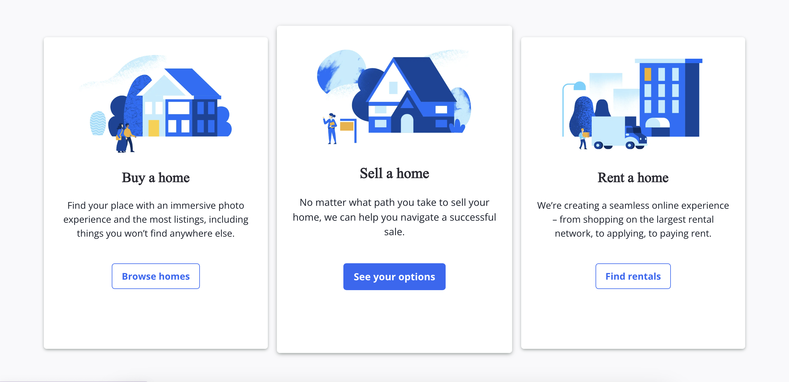

# WELCOME TO VILLOW

Introduction

Villow Clone is a replica of the popular real estate website Zillow. Villow is a platform that allows users to buy, sell, and rent properties. It provides a comprehensive database of real estate listings, including houses, apartments, and land. Users can search for properties by location, price, and other criteria, as well as save their favorite listings. The technologies used in this project include:

- Languages: Javascript, Ruby, HTML, and CSS
- Frontend: React-Redux
- Database: PostgreSQL
- Hosting: Heroku
- Asset Storage: AWS Simple Cloud Storage (S3)

# User Auth
A Villow user is able to create new profiles, which persist to both the front and backend.

# Index Page
Users can browse listings on the index page using Google Maps markers based on their address.

# Navigation Cards
The site features convenient navigation cards for major pages. Pixel perfect copy of
navigation cards from scratch.

Villow was created within a 14 day time frame. Thank you for your time and consideration! I hope you enjoy it!

